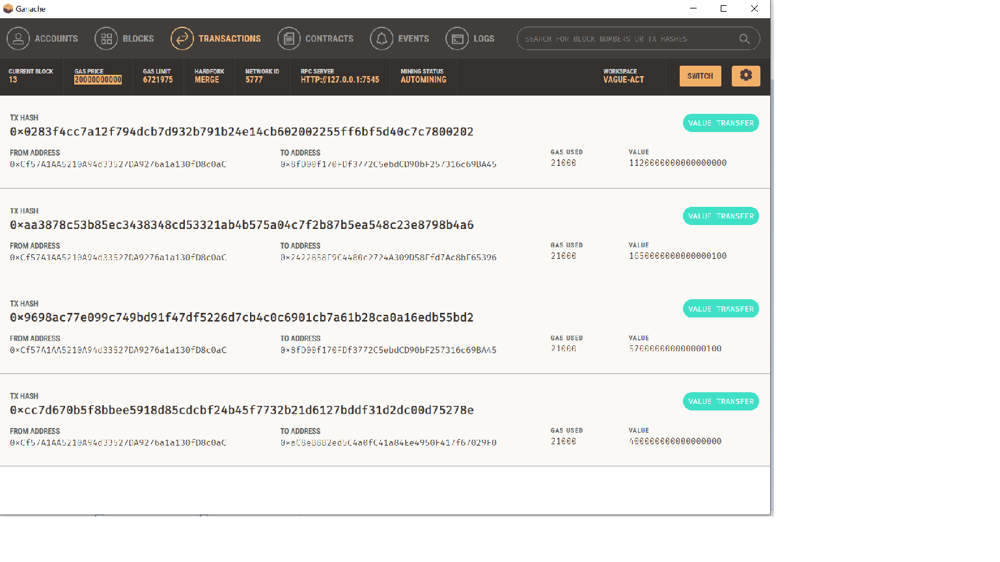
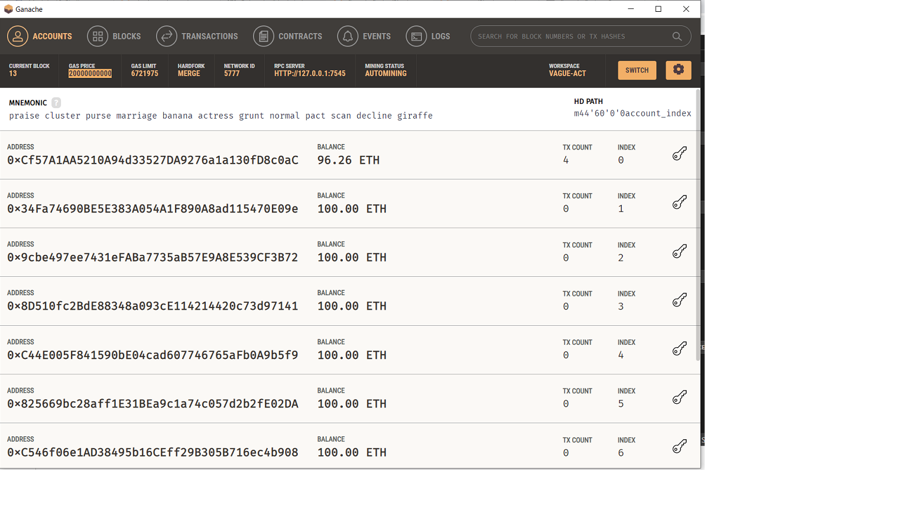

# Create a robot advisor to recommend an investment portfolio for a retirement plan.
The objective is to integrating the Ethereum blockchain network into an application in order to enable customers to instantly pay the fintech professionals whom they hire with cryptocurrency.

## Tasks
- Generate a new Ethereum account instance by using the mnemonic seed phrase provided by Ganache.
- Fetch and display the account balance associated with your Ethereum account address.
- Calculate the total value of an Ethereum transaction, including the gas estimate, that pays a Fintech Finder candidate for their work.
- Digitally sign a transaction that pays a Fintech Finder candidate, and send this transaction to the Ganache blockchain.
- Review the transaction hash code associated with the validated blockchain transaction.

## Testing the App
 1. Navigate to the Ganache accounts tab and locate the account (index 0) address, balance, and transaction (TX) count.
   
  

2. Navigate to the Ganache transactions tab and locate the transaction.
 
 
## Technologies

The technologies used are:
1. Python programming language
2. Git
3. Githib
4. Ganache
5. Streamlit
6. Web3
7. Blockchain
---

## Installation Guide

To run, download the repository, open a terminal and run: streamlit run fintech_finder.py
---

## License

MIT